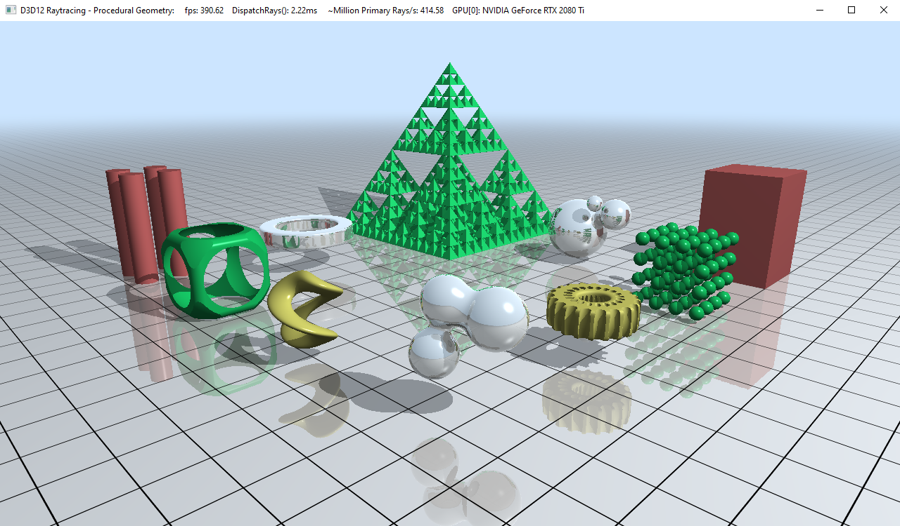

# D3D12 Raytracing Procedural Geometry sample

This sample demonstrates how to implement procedural geometry using intersection shaders. Particularly, the sample performs ray-marching of a distance field inside each AABB geometry. The sample assumes familiarity with Dx12 programming and DirectX raytracing concepts introduced in the [D3D12 Raytracing Simple Lighting sample](../D3D12RaytracingProceduralGeometry/readme.md).

##### Rendering
Each frame render happens in the sample's OnRender() call and includes executing DispatchRays() with a 2D grid dimensions matching that of backbuffer resolution and copying of the raytraced result to the backbuffer before finally presenting the it to the screen. The sample implements three shaders: *ray generation*, *closest hit* and *miss* shader: 
* The *ray generation* shader calculates a camera ray in world space for each dispatched ray corresponding to a pixel on the backbuffer. The world space ray is simply a ray's pixel screen position transformed by an inverse camera view projection matrix.
* The *closest hit* shader from the cube's hit group calculates diffuse shading at the ray hit point. The shading is computed using a dot product between the ray hit to light position and a hit triangle normal, multiplied by light's and cube's color. 
* The *miss* shader simply stores a background color. 

##### Shader accessed resources
The shaders access all the input data from constant buffers and buffer resources. There are two constant buffers: 
* CubeConstantBuffer contains cube's color - passed in via a shader record for the shader.
* SceneConstantBuffer stores scene wide camera and light parameters - made available via a global root signature.

Triangle normals are accessed from index and vertex buffers that are explicitly passed in as buffer resources to the closest hit shader. First, three hit triangle's vertex indices are loaded from a 16bit index buffer. Then, the indices are used to index into the vertex buffer and load a triangle normal that is duplicatively stored for each triangle's vertex.

## Usage
The sample starts with Fallback Layer implementation being used by default. The Fallback Layer will use raytracing driver if available, otherwise it will default to the compute fallback. This default behavior can be overriden via UI controls or input arguments.

D3D12RaytracingProceduralGeometry.exe [ -FL | -DXR | ...]
* [-FL] - select Fallback Layer API with forced compute fallback path.
* [-DXR] - select DirectX Raytracing API.

Additional arguments:
* [-forceAdapter <ID>] - create a D3D12 device on an adapter <ID> instead of adapter 0.

### UI
The title bar of the sample provides runtime information:
* Name of the sample
* Raytracing API being active:
  * FL - Fallback Layer with compute fallback being used
  * FL-DXR - Fallback Layer with raytracing driver being used
  * DXR - DirectX Raytracing being used
* Frames per second
* Million Primary Rays/s: a number of dispatched rays per second calculated based of FPS.

### Controls
* ALT+ENTER - toggles between windowed and fullscreen modes.
* 1 - select Fallback Layer API.
* 2 - select Fallback Layer API with forced compute fallback path.
* 3 - select DirectX Raytracing API.
* L - enable/disable light animation.
* C - enable/disable camera animation.

## Requirements
* Consult the main [D3D12 Raytracing readme](../../readme.md) for requirements.