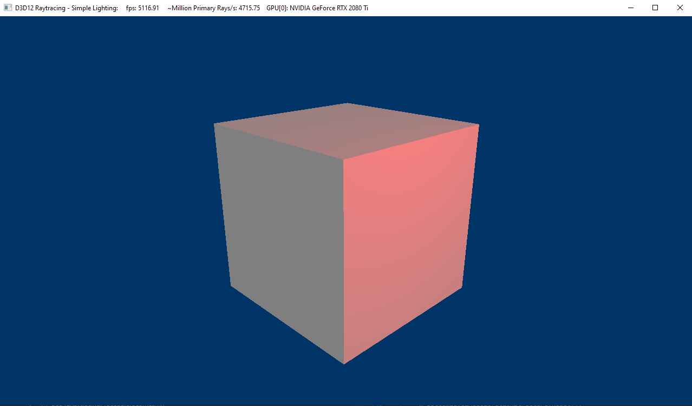

# D3D12 Raytracing Simple Lighting sample

This sample demonstrates how to do ray generation for a dynamic perspective camera and calculate simple diffuse shading for a cube from a dynamic point light. The sample assumes familiarity with Dx12 programming and DirectX raytracing concepts introduced in the [D3D12 Raytracing Hello World sample](..\D3D12RaytracingHelloWorld\readme.md).

##### Setup

There are two constant buffers: 
* CubeConstantBuffer with cube's color to be used a the closest hit shader. It is made available via shader record for the shader.
* SceneConstantBuffer stores scene wide camera and light parameters and is available via the global root signature.

Vertex buffer

##### Rendering
The sample implements three shaders: *ray generation*, *closest hit* and *miss* shader. 
* The *ray generation* shader calculates a camera ray in world space for a camera pixel corresponding to an index from the dispatched 2D grid. The world space ray is simply a ray's pixel screen position transformed by an inverse camera view projection matrix.
* The *closest hit* shader from the cube's hit group calculates diffuse shading at the ray hit point with the object. The shader looks up a triangle normal from a vertex buffer passed into the shader. Each vertex contains its position and a triangle normal.
* The *miss* shader simply stores a background color. 

## Usage
The sample starts with Fallback Layer implementation being used by default. The Fallback Layer will use raytracing driver if available, otherwise it will default to the compute fallback. This default behavior can be overriden via UI controls or input arguments.

D3D12RaytracingSimpleLighting.exe [ -FL | -DXR ]
* [-FL] - select Fallback Layer API with forced compute fallback path.
* [-DXR] - select DirectX Raytracing API.

### UI
The title bar of the sample provides runtime information:
* Name of the sample
* Raytracing API being active:
  * FL - Fallback Layer with compute fallback being used
  * FL-DXR - Fallback Layer with raytracing driver being used
  * DXR - DirectX Raytracing being used
* Frames per second
* Million Primary Rays/s: a number of dispatched rays per second calculated based of FPS.

### Controls
* ALT+ENTER - toggles between windowed and fullscreen modes.
* 1 - select Fallback Layer API.
* 2 - select Fallback Layer API with forced compute fallback path.
* 3 - select DirectX Raytracing API.

## Requirements
* Consult the main [D3D12 Raytracing readme](../../readme.md) for requirements.